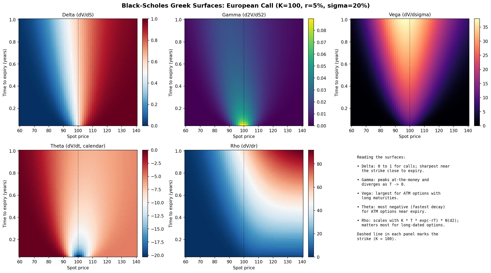
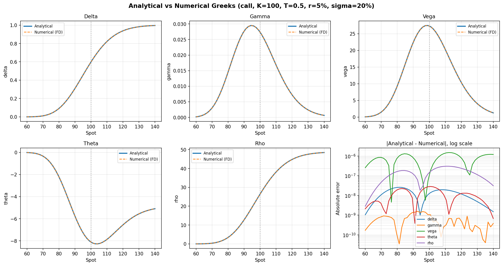
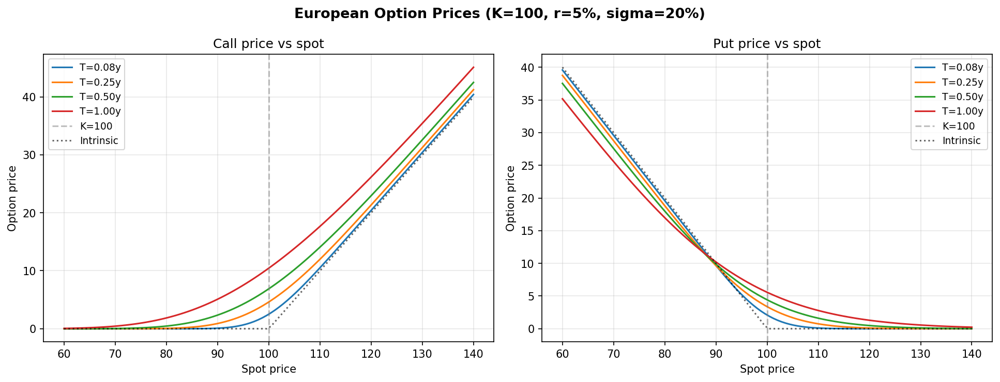

# Black-Scholes Option Pricer

A Python implementation of the Black-Scholes-Merton model for European options on dividend-paying stocks, with closed-form Greeks, finite-difference validation, and a Newton-Raphson implied volatility solver.

## Why this exists

I am currently enrolled in MIT's *Mathematical Methods for Quantitative Finance* (15.455x) through the MITx MicroMasters in Finance, where the Black-Scholes equation is derived from first principles via Itô's lemma, self-financing dynamic replication, and the heat equation. This project is a working implementation of that material. It pairs with the live options book I support at my day job, where the same Greeks (delta, gamma, vega, theta, rho) are tracked on a dashboard I built in Excel.

## What's in here

```
black_scholes_project/
├── black_scholes.py            Core pricer, analytical Greeks, IV solver
├── visualize_greeks.py         Generates the figures below
├── tests/
│   └── test_black_scholes.py   34 pytest tests (all passing)
├── figures/                    Generated visualizations
├── requirements.txt
├── LICENSE
└── README.md
```

## Quick start

```python
from black_scholes import price, greeks, implied_volatility

# Hull, Example 15.6: S=42, K=40, T=0.5, r=0.10, sigma=0.20
c = price(S=42, K=40, T=0.5, r=0.10, sigma=0.20, option_type="call")
print(f"Call price: {c:.4f}")  # 4.7594

g = greeks(S=42, K=40, T=0.5, r=0.10, sigma=0.20, option_type="call")
print(f"Delta: {g.delta:.4f}, Gamma: {g.gamma:.4f}, Vega: {g.vega:.4f}")

# Recover implied vol from a market price
iv = implied_volatility(market_price=4.7594, S=42, K=40, T=0.5, r=0.10, option_type="call")
print(f"Implied vol: {iv:.4f}")  # 0.2000
```

## Math reference

**Pricing** (with continuous dividend yield q):

$$C = S e^{-qT} N(d_1) - K e^{-rT} N(d_2)$$

$$P = K e^{-rT} N(-d_2) - S e^{-qT} N(-d_1)$$

$$d_1 = \frac{\ln(S/K) + (r - q + \sigma^2/2) T}{\sigma \sqrt{T}}, \quad d_2 = d_1 - \sigma \sqrt{T}$$

**Greeks** (call, with dividend yield q):

| Greek | Formula |
|---|---|
| Delta | $e^{-qT} N(d_1)$ |
| Gamma | $\frac{e^{-qT} n(d_1)}{S \sigma \sqrt{T}}$ |
| Vega | $S e^{-qT} n(d_1) \sqrt{T}$ |
| Theta | $-\frac{S e^{-qT} n(d_1) \sigma}{2 \sqrt{T}} - r K e^{-rT} N(d_2) + q S e^{-qT} N(d_1)$ |
| Rho | $K T e^{-rT} N(d_2)$ |

where $n(\cdot)$ is the standard normal PDF and $N(\cdot)$ is the CDF.

## Visualizations

### Greek surfaces over (spot, time)

These heatmaps show how each Greek behaves across the moneyness/maturity space, holding K=100, r=5%, σ=20%, q=0%. The dashed line marks the strike.



The Greek behavior is exactly what theory predicts:

- **Delta** transitions smoothly from ~0 (deep OTM) to ~1 (deep ITM), with the steepest gradient near the strike close to expiry.
- **Gamma** peaks at-the-money and grows unboundedly as T → 0 (the "gamma squeeze" regime that drives short-gamma risk near expiry).
- **Vega** is largest for at-the-money options with long maturities, because that is where uncertainty about terminal payoff is greatest.
- **Theta** is most negative for ATM options near expiry — the classic "theta accelerates" pattern that defines short-vol P&L attribution.
- **Rho** scales with the discount factor and matters most for long-dated options.

### Validation: analytical vs numerical Greeks

To validate the analytical formulas, I compute the same Greeks via central finite differences on the price function and overlay them. The two curves should be visually indistinguishable; the log-scale error panel confirms maximum disagreement of ~10⁻⁶ to ~10⁻¹⁰ across all five Greeks.



### Price curves

European call and put prices across moneyness for several maturities, with the intrinsic-value lines shown for reference.



## Implied volatility solver

`implied_volatility()` uses Newton-Raphson with vega as the derivative:

$$\sigma_{n+1} = \sigma_n - \frac{\text{BS}(\sigma_n) - \text{market price}}{\text{vega}(\sigma_n)}$$

Round-trip tests across sigma values from 10% to 60% recover the original volatility to within 10⁻⁶.

## Running the tests

```
pip install -r requirements.txt
pytest tests/ -v
```

All 34 tests should pass:

```
======================= 34 passed in 2.91s =======================
```

The suite covers Hull (10th ed.) reference values, put-call parity across multiple parameter sets, Greek sign and magnitude conventions, deep-ITM/OTM boundary behavior, analytical-vs-numerical Greek agreement, IV round-trip accuracy, and input validation.

## What I learned building this

*(I'll fill this in after working through the code in depth — what concept clicked, what was harder than expected, what I would do differently.)*

## References

- Hull, J. C. (2018). *Options, Futures, and Other Derivatives*, 10th ed. Pearson.
- Black, F., & Scholes, M. (1973). The Pricing of Options and Corporate Liabilities. *Journal of Political Economy*, 81(3), 637–654.
- Merton, R. C. (1973). Theory of Rational Option Pricing. *Bell Journal of Economics and Management Science*, 4(1), 141–183.
- MITx 15.455x course material on Itô calculus and the Black-Scholes derivation.

## License

MIT — see `LICENSE`.
